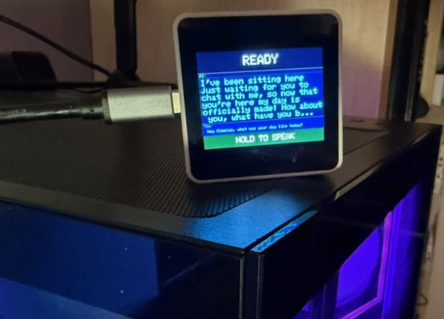

# Hermes Voice Assistant



A standalone WiFi voice assistant running on the **M5Stack Core S3 SE**. Hold the touch screen to speak — the device records your voice, transcribes it locally, sends it to a [Hermes agent](https://hermes-agent.nousresearch.com), and speaks the response through its built-in speaker.

---

## Pipeline

```
Hold touch screen
       │
       ▼
  Record PCM
  (16 kHz, PSRAM)
       │
       ▼
  whisper.cpp  ──HTTP──▶  Transcript text
  (local server)
       │
       ▼
  Hermes Agent ──HTTP──▶  Response text
  (local API server)
       │
       ▼
  Kokoro TTS   ──HTTP──▶  PCM audio
  (local Docker)
       │
       ▼
  Speaker
```

All three servers run on a local machine. The Hermes agent connects to your configured LLM provider (cloud or local).

---

## Hardware

| | |
|---|---|
| **Board** | M5Stack Core S3 SE |
| **MCU** | ESP32-S3 @ 240 MHz |
| **RAM** | 512 KB SRAM + 8 MB PSRAM |
| **Display** | 2.0" IPS 320×240, capacitive touch |
| **Microphone** | SPM1423 PDM |
| **Speaker** | 1 W via AW88298 amp |
| **Battery** | 900 mAh Li-Po |
| **Connectivity** | WiFi 802.11 b/g/n |

---

## Server Requirements

Three servers must be running and reachable on your local network before flashing.

### 1. whisper.cpp — Speech-to-Text (port 7124)

**Docker (recommended):**

```bash
mkdir -p servers/whisper-stt/models
wget -O servers/whisper-stt/models/ggml-small.en.bin \
  https://huggingface.co/ggerganov/whisper.cpp/resolve/main/ggml-small.en.bin

cd servers/whisper-stt && docker compose up -d
```

**macOS bare process (lowest latency on Apple Silicon):**

```bash
brew install whisper-cpp
chmod +x servers/whisper-stt/start.sh
./servers/whisper-stt/start.sh
```

> Apple Silicon transcribes ~70× real-time (~0.25 s per 18 s clip). Docker on CPU (x86-64) is ~3–4× real-time. Both produce identical output.

### 2. Hermes Agent — LLM (port 7237)

Install [Hermes](https://hermes-agent.nousresearch.com) and enable its API server by adding the following to `~/.hermes/.env`:

```bash
API_SERVER_ENABLED=true
API_SERVER_KEY=your-secret-key      # anything you choose — must match hermes_key in secrets.json
API_SERVER_PORT=7237
API_SERVER_HOST=0.0.0.0             # must be 0.0.0.0 so the device can reach it
```

Restart the gateway to apply:

```bash
systemctl --user restart hermes-gateway
```

Verify it's running:

```bash
curl http://localhost:7237/v1/health
# → {"status": "ok", "platform": "hermes-agent"}
```

The active LLM is set in `~/.hermes/config.yaml`. Any model supported by Hermes works — cloud or local.

### 3. Kokoro TTS — Text-to-Speech (port 7235)

CPU-only Docker container. Works on any x86-64 machine:

```bash
cd servers/kokoro-tts && docker compose up -d
```

First start downloads the model (~330 MB). Test it:

```bash
curl -X POST http://YOUR_SERVER_IP:7235/v1/audio/speech \
  -H "Content-Type: application/json" \
  -d '{"model":"kokoro","voice":"af_sky","input":"Hello world","response_format":"pcm"}' \
  --output test.pcm
```

---

## ESP32 Setup

### Requirements

- [VS Code](https://code.visualstudio.com/) + [PlatformIO IDE extension](https://platformio.org/install/ide?install=vscode)
- Python 3.10–3.13 (espressif32 platform requirement)
- USB-C cable

> If your system Python is newer (3.14+), use [mise](https://mise.jdx.dev/) with a local Python 3.13 — a `mise.toml` is included in the project. Then invoke PlatformIO as `python -m platformio` instead of `pio`.

### Build and Flash

```bash
# Compile
python -m platformio run

# Flash firmware
python -m platformio run --target upload

# Flash secrets (first time, or when secrets.json changes)
python -m platformio run --target uploadfs
```

Flash order on first setup: `upload` then `uploadfs`. Subsequent firmware updates only need `upload` — secrets survive in LittleFS.

---

## Secrets

Copy the example and fill in your values:

```bash
cp data/secrets.example.json data/secrets.json
```

```json
{
  "wifi_ssid": "YourNetwork",
  "wifi_pass": "YourPassword",
  "openai_key": "",
  "stt_host": "10.10.x.x",
  "stt_port": "7124",
  "hermes_host": "10.10.x.x",
  "hermes_port": "7237",
  "hermes_key": "your-secret-key",
  "tts_host": "10.10.x.x",
  "tts_port": "7235"
}
```

`hermes_key` must match `API_SERVER_KEY` in `~/.hermes/.env` on the Hermes server. `data/secrets.json` is gitignored — never committed.

---

## Display Layout

```
┌─────────────────────────┐
│         READY           │  State bar (colour changes by state)
├─────────────────────────┤
│ AI:                     │
│                         │  Response panel — Hermes reply
│  [response text]        │
│                         │
├─────────────────────────┤
│ You: [transcript]       │  Transcript panel — what you said
├─────────────────────────┤
│    ▓ HOLD TO SPEAK ▓    │  Touch zone — hold to record
└─────────────────────────┘
```

| Colour | State |
|--------|-------|
| Navy | Ready |
| Dark red | Recording |
| Dark orange | Transcribing |
| Dark purple | Thinking |
| Dark green | Speaking |

---

## Usage

1. Power on — device connects to WiFi and shows **READY**
2. Hold the bottom touch bar — screen turns red, mic is active
3. Speak your question
4. Release — device transcribes, sends to Hermes, and speaks the answer
5. Transcript and response appear on screen

---

## Architecture Notes

- **PSRAM for all audio buffers** — record buffer (256 KB) and TTS PCM buffer (600 KB) use `heap_caps_malloc(MALLOC_CAP_SPIRAM)`. Internal SRAM is only 512 KB total.
- **I2S sharing** — mic and speaker share the I2S peripheral. `Mic.end()` is called before `Speaker.begin()` and vice versa on every state transition.
- **HTTP/1.0 for TTS** — `http.useHTTP10(true)` prevents chunked transfer encoding from corrupting raw PCM data read via `getStreamPtr()`.
- **Bearer auth** — every Hermes request includes `Authorization: Bearer <hermes_key>`. Key is loaded from LittleFS at boot, never compiled in.
- **Touch trigger** — the bottom 35 px of the screen is the push-to-talk zone, detected via M5Unified's touch API.

---

## Project Structure

```
├── src/
│   ├── main.cpp          — state machine, WiFi, touch input
│   ├── audio_capture.*   — PDM mic via M5Unified, PSRAM ring buffer
│   ├── audio_playback.*  — M5Unified speaker, raw PCM playback
│   ├── stt.*             — HTTP POST to whisper.cpp, WAV header, JSON parse
│   ├── llm.*             — HTTP POST to Hermes agent API, Bearer auth, response parse
│   ├── tts.*             — HTTP POST to Kokoro, PCM download, speaker playback
│   ├── display.*         — 4-zone screen layout, word-wrapped text panels
│   ├── secrets.*         — LittleFS JSON loader
│   └── config.h          — SAMPLE_RATE, REC_MAX_BYTES
├── data/
│   ├── secrets.example.json   — copy to secrets.json and fill in
│   └── secrets.json           — gitignored, flashed via uploadfs
├── servers/
│   ├── kokoro-tts/
│   │   └── docker-compose.yml — Kokoro TTS CPU Docker config
│   └── whisper-stt/
│       └── start.sh           — whisper-server launch script
└── platformio.ini
```
